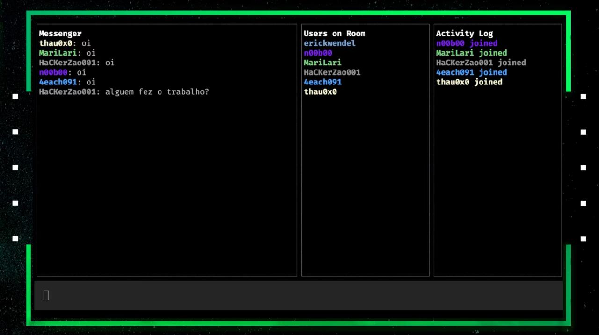

## HackerChat by saviollage


<h1 align="center">
    
</h1>


## :page_with_curl: About

Hacker Chat is an application developed during the week JS expert 03, an application that you chat in a multiplatform chat in an incredible way, using only the terminal.

Lessons of the Week JS Expert 3.0 Building a multiplatform chat using command line and Advanced JavaScript.


## :rocket: Instalation


```bash
  # Clone the project:
  $ git clone https://github.com/saviollage/hackerChat

```

### Server
```bash
  # Enter Directory:
  $ cd hackerChat

  # Enter Directory:
  $ cd server

  # Install the dependencies:
  $ npm ci

  # Running app:
  $ npm start
  ```

### Client

```bash
  # Enter Directory:
  $ cd hackerChat

  # Enter Directory:
  $ cd client

  # Install the dependencies:
  $ npm ci

  # Running the app (--hostUri is optional, by default the host is https://hackerchat-saviollage.herokuapp.com)
  $ node index --username <YOUR NAME> --room <ROOM NAME> 
  
  # Or you can run app with example 
  $ npm run user01 
  ```